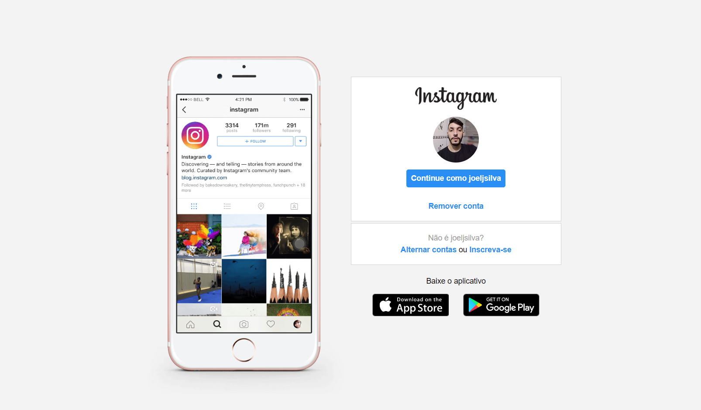
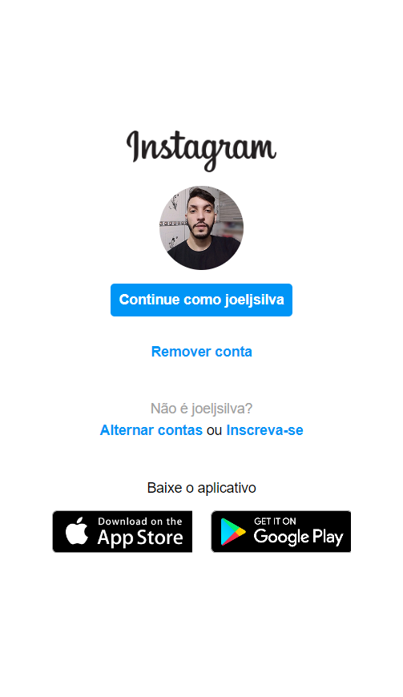

# Projeto clone Instagram 

 Projeto de clonagem da pagina de Login do Instagram utilizando os conceitos de Flexbox aprendido durante o curso de Flexbox.

## Resultado final

## Versão final mobile/responsiva

